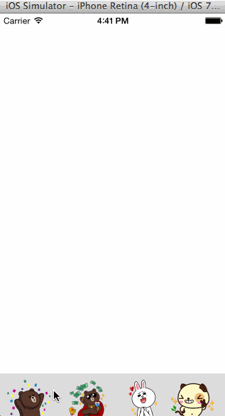

Canvas & Stickers
========

Week 4 Homework

Completed Tasks - 
You should be able to drag the tray up or down.
Once the tray is revealed, you shouldn't be able to drag it any more.
After releasing the tray, it should either move to its hidden position or its revealed position.
Dragging an image from the tray should create a new copy of the image which can be dragged into the canvas area.
Pinching images in the canvas area should resize them
Allow the user to rotate the image

Did not complete - 
Implement scrollable tray of images
Add a camera icon to the tray
Tapping the camera icon opens the camera.
After taking a picture, the picture is added to the view as a background view
